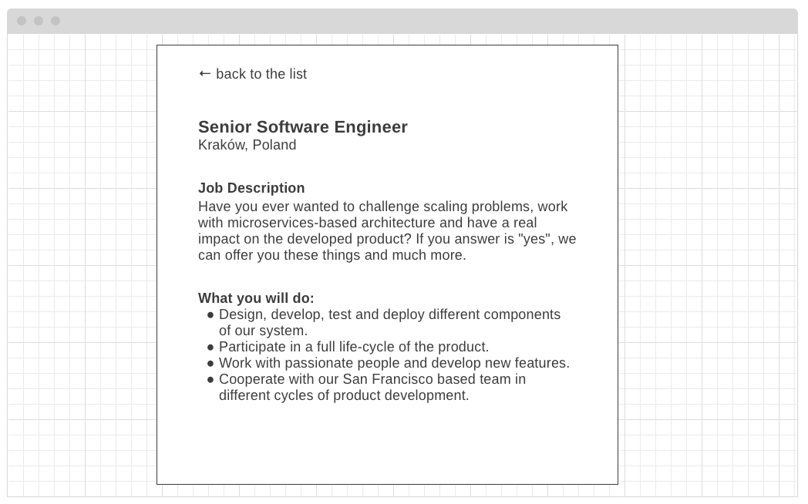

# Postings List App

- [Goal](#goal)
- [User Stories](#user-stories)
- [Scenario](#scenario)
- [Wireframes](#wireframes)
- [Public API](#public-api)
- [FAQ](#faq)

## Goal

Develop production-ready application for candidates that displays a list and details of postings published by Company which are available via [Public API](#public-api).

Your solution should:

- implement [user stories](#user-stories)
- work accordingly to provided [scenarios](#scenario)
- follow or extend patterns from [wireframes](#wireframes)
- pass [e2e tests](tests/README.md)

Optionally, as an author you can also:

- include additional enhancements or features not mentioned in this README
- add more tests for core scenarios and user flows

## User stories

- as a candidate, I want to see list of postings published by Company
- as a candidate, I want to filter postings published by Company by `location.country` and `department`
- as a candidate, I want to see `jobAd.sections.jobDescription` and `jobAd.sections.jqualifications` of postings published by Company

## Scenario

1. Open `localhost:8080`
2. Postings list loads
3. Candidate filter list by country and department
4. List displays only filtered elements
5. Click an item on the list
6. Posting details containing `jobAd.sections.jobDescription` and `jobAd.sections.jqualifications` section opens
7. Click `backlink` to return to the list

## Wireframes

### List of postings published by Company

### Posting details contatining `jobAd.sections.jobDescription` and `jobAd.sections.jqualifications` section

## Public API
* Api link

### Get list of postings published by Company
* Api link

### Get posting details
* Api link

### List of departments
* Api link

### List of countries

The countries dictionary is not yet exposed through Public API, but you can obtain the list using your preferred API, for example - https://restcountries.eu/

## FAQ

### Which technologies can I use?

The application can be developed in any technology you want, as long as the repository will contain clear instructions on how to install and run it locally.

### What does `production-ready` means?

From the technical standpoint, the application should be production-ready meaning that it requires no implicit dependencies, all framework-wise settings should be set as `production` and the codebase itself should be free of hacks, TODO comments, unfinished ideas or empty files. From the product standpoint, production-ready means that you did all the best to satisfy end-user's needs and real-life scenarios.

### How should I design the application

The application should be designed in harmony with your sense of aesthetics respecting provided wireframes.

### Should I develop a full-blown server?

No, basic routes and serving static assets are enough. Everything else is up to you.

### What does the _posting_ term mean?

**Posting** is a term from Company domain, describing "a posted job" - job offer that is available online and ready to be consumed by, for example, 3rd party job boards (i.e. Monster, Pracuj.pl, etc.).

### How to submit a great solution

- Make sure we understand how to run your program. Add RUN.md file that describes how to start it (if not using standard ways to run a program).
- We will run a formal code review on your solution. Make sure your code is not only correct but also easy to read and reason about.
